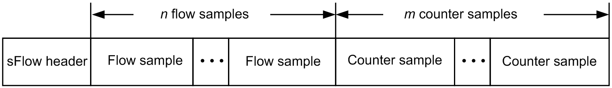

# sFlow (Sampled Flow)

## Scalable Network Visibility

To understand sFlow's design, it helps to first examine the challenges of network monitoring and the limitations of earlier solutions.

Network operators require continuous insight into traffic across their infrastructure to monitor bandwidth, detect anomalies, and track traffic matrices (who is talking to whom). Capturing every packet in full is too bandwidth-intensive to scale across an entire network. Operators instead need traffic metadata.

### The Legacy Approach: Stateful Flow Export

Before sFlow, the industry relied on stateful flow tracking (e.g., NetFlow or IPFIX). In this model, the network switch or router maintains an active in-memory cache of every ongoing conversation (flow). While highly accurate, stateful tracking introduces severe scaling problems:

- **Memory Exhaustion**: Tracking millions of concurrent data center connections requires large, dedicated flow tables.

- **CPU Overhead**: The device's CPU must constantly create, update, and expire flow records.

- **Vulnerability to DDoS**: Attackers generating floods of short-lived packets can easily overflow the flow cache, causing the device to drop records and lose visibility right when it is needed most.

- **Export Latency**: Records are only sent to the monitoring server after a flow expires or ages out, delaying visibility by seconds to minutes.

### The Solution: sFlow

sFlow was engineered to solve the scaling and resource limitations of stateful flow export by eliminating per-flow state from the network device entirely. The device acts as a stateless data source: it samples packets, polls counters, and immediately exports the raw results. All stateful aggregation and traffic analysis are deferred to a centralized external collector.

> **Note:** sFlow is an openly published industry specification managed by [sFlow.org](https://sflow.org/), not a formal IETF standard like IPFIX. It is nonetheless widely adopted and implemented across major switching silicon vendors.


## The Three-Tier Architecture

sFlow defines a three-component architecture where the network device handles raw data collection and the collector handles all analysis:

- **Switching ASIC (Hardware)**: Performs packet sampling at wire speed in the forwarding pipeline. Because the sampling decision is made entirely in hardware, it adds no load to the device's CPU.

- **sFlow Agent (Software)**: Runs on the switch's CPU. Receives sampled packet headers from the ASIC, polls hardware interface counters, and encapsulates both data types into sFlow datagrams for export.

- **Collector (External Server)**: Receives the raw datagrams and performs all analysis: reconstructing traffic matrices, estimating volume, and detecting anomalies.

```
┌─────────────────────────────────────────┐
│            Network Device               │
│                                         │
│  ┌──────────────┐   ┌────────────────┐  │
│  │ Switching    │   │ sFlow Agent    │  │
│  │ ASIC         │   │ (software)     │  │
│  │              │   │                │  │
│  │ Packet       │──>│ Encapsulates   │  │       UDP/6343
│  │ Sampling     │   │ samples into   │───────────────────>  Collector
│  │ (hardware)   │   │ UDP datagrams  │  │
│  └──────────────┘   │                │  │
│                     │ Counter        │  │
│  Interface          │ Polling        │  │
│  Counters ─────────>│ (periodic)     │  │
│                     └────────────────┘  │
└─────────────────────────────────────────┘
```


## Core Mechanisms: Sampling and Polling

sFlow relies on two independent streams of telemetry data, both exported to the collector:

- **Packet Sampling**: The switching ASIC associates a countdown counter with each monitored port. For every packet passing through, the counter decrements. When it hits zero, the packet's header (the first 128 bytes by default, configurable) is copied to the sFlow agent. The counter then resets to a random value drawn from the configured sampling rate (1-in-*N*). The randomized reset prevents periodic sampling from systematically missing synchronized traffic patterns.

- **Counter Polling**: The sFlow agent reads standard hardware interface counters (bytes, packets, errors, discards) at a configurable interval (20 seconds is a common default) and sends these snapshots to the collector.


## sFlow Datagram Format (v5)

The sFlow agent bundles sampled headers and counter snapshots into sFlow datagrams and pushes them to the collector over UDP (default port 6343). The export is unidirectional: the agent pushes data and the collector never sends a response. Each datagram consists of a fixed header followed by one or more sample records.



### Encoding: XDR

All sFlow v5 fields are encoded using **XDR** (External Data Representation, RFC 4506). XDR defines the smallest integer type as an unsigned 32-bit (4-byte) integer — there is no 1-byte or 2-byte type in the encoding. This means even fields whose logical value would fit in a single byte (e.g., sFlow Version = `5`, Agent Address Type = `1` or `2`) are encoded as full 4-byte words. All multi-byte values use **network byte order** (big-endian).

This fixed-width encoding is mandated by the XDR standard for three practical reasons:

- **Aligned memory access**: Most CPUs read 32-bit-aligned words in a single operation. Unaligned access is slower on many architectures and causes hardware faults on some (e.g., older SPARC, ARM).

- **Parsing simplicity**: Every field starts at a predictable 4-byte-aligned offset, so parsers can extract values at fixed positions without tracking variable-length packing.

- **Negligible overhead**: The per-field cost is at most 3 extra bytes. Across the entire datagram header (~7 fields), the total overhead is roughly 20 bytes — trivial compared to the sampled packet headers (128 bytes each) that make up the bulk of the payload.

### sFlow Header

Every sFlow v5 datagram begins with the following header:

```
 0                   1                   2                   3
 0 1 2 3 4 5 6 7 8 9 0 1 2 3 4 5 6 7 8 9 0 1 2 3 4 5 6 7 8 9 0 1
+-+-+-+-+-+-+-+-+-+-+-+-+-+-+-+-+-+-+-+-+-+-+-+-+-+-+-+-+-+-+-+-+
|                      sFlow Version (5)                        |
+-+-+-+-+-+-+-+-+-+-+-+-+-+-+-+-+-+-+-+-+-+-+-+-+-+-+-+-+-+-+-+-+
|                   Agent Address Type                          |
+-+-+-+-+-+-+-+-+-+-+-+-+-+-+-+-+-+-+-+-+-+-+-+-+-+-+-+-+-+-+-+-+
|                   Agent Address (4 or 16 bytes)               |
+-+-+-+-+-+-+-+-+-+-+-+-+-+-+-+-+-+-+-+-+-+-+-+-+-+-+-+-+-+-+-+-+
|                      Sub-Agent ID                             |
+-+-+-+-+-+-+-+-+-+-+-+-+-+-+-+-+-+-+-+-+-+-+-+-+-+-+-+-+-+-+-+-+
|                    Sequence Number                            |
+-+-+-+-+-+-+-+-+-+-+-+-+-+-+-+-+-+-+-+-+-+-+-+-+-+-+-+-+-+-+-+-+
|                     System Uptime (ms)                        |
+-+-+-+-+-+-+-+-+-+-+-+-+-+-+-+-+-+-+-+-+-+-+-+-+-+-+-+-+-+-+-+-+
|                    Number of Samples                          |
+-+-+-+-+-+-+-+-+-+-+-+-+-+-+-+-+-+-+-+-+-+-+-+-+-+-+-+-+-+-+-+-+
|                     Sample Records ...                        |
+-+-+-+-+-+-+-+-+-+-+-+-+-+-+-+-+-+-+-+-+-+-+-+-+-+-+-+-+-+-+-+-+
```

| Field              | Size          | Description |
|--------------------|---------------|-------------|
| sFlow Version      | 4 bytes       | Protocol version. Always `5` for sFlow v5. |
| Agent Address Type | 4 bytes       | `1` = IPv4, `2` = IPv6. |
| Agent Address      | 4 or 16 bytes | IP address of the sFlow agent sending this datagram. |
| Sub-Agent ID       | 4 bytes       | Distinguishes multiple sub-agents on the same device (e.g., per-ASIC agents). |
| Sequence Number    | 4 bytes       | Per-agent datagram counter. Increments by one for each datagram sent. Gaps indicate lost datagrams. |
| System Uptime      | 4 bytes       | Milliseconds since the agent was last (re)started. Used for [restart detection](#datagram-loss-and-agent-restart-detection). |
| Number of Samples  | 4 bytes       | Count of sample records that follow in this datagram. |

### Sample Records

Each sample record is prefixed by a **sample type** and **sample length**:

```
+-+-+-+-+-+-+-+-+-+-+-+-+-+-+-+-+-+-+-+-+-+-+-+-+-+-+-+-+-+-+-+-+
|          Enterprise (20 bits)       | Sample Type (12 bits)   |
+-+-+-+-+-+-+-+-+-+-+-+-+-+-+-+-+-+-+-+-+-+-+-+-+-+-+-+-+-+-+-+-+
|                     Sample Length                             |
+-+-+-+-+-+-+-+-+-+-+-+-+-+-+-+-+-+-+-+-+-+-+-+-+-+-+-+-+-+-+-+-+
|                     Sample Data ...                           |
+-+-+-+-+-+-+-+-+-+-+-+-+-+-+-+-+-+-+-+-+-+-+-+-+-+-+-+-+-+-+-+-+
```

The standard sample types (enterprise = 0) are:

| Sample Type             | Value | Description |
|-------------------------|-------|-------------|
| Flow Sample             | 1     | Contains sampled packet headers and associated metadata. |
| Counter Sample          | 2     | Contains interface counter snapshots. |
| Expanded Flow Sample    | 3     | Same as Flow Sample, with wider (32-bit) fields for interface indices and source ID. |
| Expanded Counter Sample | 4     | Same as Counter Sample, with wider fields. |

### Flow Sample

A flow sample records metadata about a single sampled packet:

| Field                  | Size     | Description |
|------------------------|----------|-------------|
| Sequence Number        | 4 bytes  | Per-source sample counter. |
| Source ID              | 4 bytes  | Encoded as type (top 8 bits) and index (lower 24 bits). Type `0` = ifIndex. |
| Sampling Rate          | 4 bytes  | The configured 1-in-*N* sampling rate at the time of capture. |
| Sample Pool            | 4 bytes  | Total packets observed on this source since the agent started. |
| Drops                  | 4 bytes  | Samples dropped due to resource exhaustion (e.g., agent CPU overload). |
| Input Interface        | 4 bytes  | ifIndex of the ingress interface (`0` if unknown). |
| Output Interface       | 4 bytes  | ifIndex of the egress interface (`0` if unknown, `0x80000000` if multiple via multicast/broadcast). |
| Number of Flow Records | 4 bytes  | Count of flow records that follow. |
| Flow Records           | variable | One or more flow records (see below). |

Each flow record is prefixed by its own enterprise/type and length. The most common type is the **Raw Packet Header**:

| Field           | Size     | Description |
|-----------------|----------|-------------|
| Header Protocol | 4 bytes  | Link-layer type. `1` = Ethernet. |
| Frame Length    | 4 bytes  | Original length of the packet on the wire (before truncation). |
| Stripped        | 4 bytes  | Bytes stripped from the packet (e.g., 4 bytes for FCS). |
| Header Length   | 4 bytes  | Number of header bytes captured in this record. |
| Header          | variable | The raw packet header bytes, padded to a 4-byte boundary. |

The collector uses **Header Protocol** to determine how to parse the raw bytes (typically as an Ethernet frame), and **Frame Length** together with the **Sampling Rate** to estimate the actual traffic volume that the sampled packet represents.

### Counter Sample

A counter sample records a snapshot of interface statistics:

| Field                     | Size     | Description |
|---------------------------|----------|-------------|
| Sequence Number           | 4 bytes  | Per-source counter sample sequence number. |
| Source ID                 | 4 bytes  | Encoded the same way as in flow samples. |
| Number of Counter Records | 4 bytes  | Count of counter records that follow. |
| Counter Records           | variable | One or more counter records (see below). |

The most common counter record type is **Generic Interface Counters** (enterprise = 0, type = 1), which mirrors the standard SNMP IF-MIB counters:

| Field              | Size    | Description |
|--------------------|---------|-------------|
| ifIndex            | 4 bytes | Interface index. |
| ifType             | 4 bytes | IANA ifType (e.g., `6` = ethernetCsmacd). |
| ifSpeed            | 8 bytes | Interface speed in bits per second. |
| ifDirection        | 4 bytes | `0` = unknown, `1` = full-duplex, `2` = half-duplex, `3` = in-only, `4` = out-only. |
| ifStatus           | 4 bytes | Bit 0 = ifAdminStatus (up/down), bit 1 = ifOperStatus (up/down). |
| ifInOctets         | 8 bytes | Total bytes received. |
| ifInUcastPkts      | 4 bytes | Unicast packets received. |
| ifInMulticastPkts  | 4 bytes | Multicast packets received. |
| ifInBroadcastPkts  | 4 bytes | Broadcast packets received. |
| ifInDiscards       | 4 bytes | Inbound packets discarded (not due to errors). |
| ifInErrors         | 4 bytes | Inbound packets with errors. |
| ifInUnknownProtos  | 4 bytes | Inbound packets with unsupported protocols. |
| ifOutOctets        | 8 bytes | Total bytes transmitted. |
| ifOutUcastPkts     | 4 bytes | Unicast packets transmitted. |
| ifOutMulticastPkts | 4 bytes | Multicast packets transmitted. |
| ifOutBroadcastPkts | 4 bytes | Broadcast packets transmitted. |
| ifOutDiscards      | 4 bytes | Outbound packets discarded. |
| ifOutErrors        | 4 bytes | Outbound packets with errors. |
| ifPromiscuousMode  | 4 bytes | `1` = promiscuous mode enabled, `0` = disabled. |

### Datagram Loss and Agent Restart Detection

Because sFlow uses UDP, datagrams can be silently dropped by the network. The collector detects this using the **Sequence Number** in the datagram header, which increments by one for every datagram the agent sends. If the collector receives datagram 4,000 followed by datagram 4,005, the gap of 4 tells it exactly how many datagrams were lost and how many traffic samples are unaccounted for.

This mechanism creates an ambiguity when the sFlow agent restarts. A restart resets the Sequence Number to 1, so the collector sees a large apparent gap (e.g., 50,000 to 1) that looks identical to catastrophic datagram loss. The same problem applies to every other cumulative field in the protocol:

- **Sample Pool** (flow sample): total packets observed on a source since the agent started.
- **Interface counters** (counter sample): cumulative byte and packet totals such as `ifInOctets` and `ifOutOctets`.

The **System Uptime** field resolves this ambiguity. If System Uptime drops from a large value to near zero in the same datagram where the Sequence Number resets, the collector knows the agent restarted and treats all cumulative fields as fresh baselines. If System Uptime continues to increase, a Sequence Number gap is genuine datagram loss, and a counter drop indicates a wrap or reset that requires separate handling.


## Configuration: Hardware vs. Software and Trade-offs

### ASIC Support

For sFlow to sustain wire-speed sampling without consuming switch CPU resources, the switching ASIC must natively support packet sampling (configured via the Switch Abstraction Interface in operating systems like SONiC). Without hardware ASIC support (e.g., in virtualized lab environments), sFlow falls back to software-based sampling on the CPU. Software sampling is functionally equivalent but cannot match wire-speed throughput, as every sampled packet must be copied and processed by the CPU rather than handled in the forwarding pipeline.

### Tuning the Sampling Rate (1-in-N)

The sampling rate is the most critical sFlow configuration parameter. It controls how many packets are sampled and must be tuned based on the interface speed:

| Interface Speed | Typical Sampling Rate    |
|-----------------|--------------------------|
| 1 Gbps          | 1-in-512 to 1-in-2048    |
| 10 Gbps         | 1-in-2048 to 1-in-8192   |
| 40 Gbps         | 1-in-8192 to 1-in-16384  |
| 100 Gbps        | 1-in-16384 to 1-in-32768 |

- **Aggressive Sampling (Lower N)**: Provides higher accuracy for smaller flows but increases bandwidth consumption on the management network, CPU load on the agent, and storage requirements on the collector.

- **Conservative Sampling (Higher N)**: Reduces overhead but sacrifices statistical accuracy for short-lived or low-volume flows.


## Limitations

While highly scalable, sFlow's stateless sampling model introduces specific constraints:

- **Statistical Inaccuracy for Small Flows**: Because traffic volume is extrapolated from samples, rare or very brief connections may go entirely unsampled. sFlow is designed for aggregate trend analysis, not forensic per-connection auditing.

- **No Payload Data**: sFlow exports only packet headers (128 bytes by default). It cannot be used for deep packet inspection (DPI) or application-layer payload analysis.

- **Unreliable Transport**: UDP provides no delivery guarantees. If the management network drops datagrams, those traffic samples are permanently lost.

- **No Native Security**: The protocol lacks built-in encryption or authentication. sFlow traffic must be isolated to secure, out-of-band management networks to prevent spoofing or interception.

- **Total Collector Dependency**: The network device performs no analysis. If the collector is unreachable, all monitoring data is lost for the duration of the outage.


## The Collector Ecosystem

Because the network device acts only as a raw data source, the ecosystem relies on specialized external software to ingest, decode, and visualize sFlow data. Common tools include:

| Tool | Description |
|---|---|
| [sflowtool](https://github.com/sflow/sflowtool) | Reference command-line utility from InMon. Decodes sFlow datagrams and outputs parsed text, JSON, or converts to pcap format. Useful for debugging and scripting. |
| [sFlow-RT](https://sflow-rt.com/) | Real-time analytics engine from InMon. Provides a REST API for defining flow metrics, setting thresholds, and triggering actions. Designed for integration with SDN controllers, orchestration platforms, and custom dashboards. |
| [ntopng](https://www.ntop.org/products/traffic-analysis/ntop/) | Full-featured network traffic analysis tool with a web-based GUI. Supports sFlow alongside NetFlow/IPFIX for unified visibility across mixed environments. |
| [Prometheus sFlow exporter](https://github.com/sflow-rt/prometheus) | Bridges sFlow-RT metrics into Prometheus for monitoring and alerting via Grafana dashboards. |
| [pmacct](http://www.pmacct.net/) | Network accounting and data aggregation toolkit. Collects sFlow (and NetFlow/IPFIX) data and exports to databases (PostgreSQL, MySQL), message queues (Kafka, RabbitMQ), or time-series stores. |

For this project, sFlow datagrams from SONiC devices are decoded using a custom Python script ([sonic_sflow_decode.py](src/sonic_sflow_decode.py)) based on the datagram format described above.
